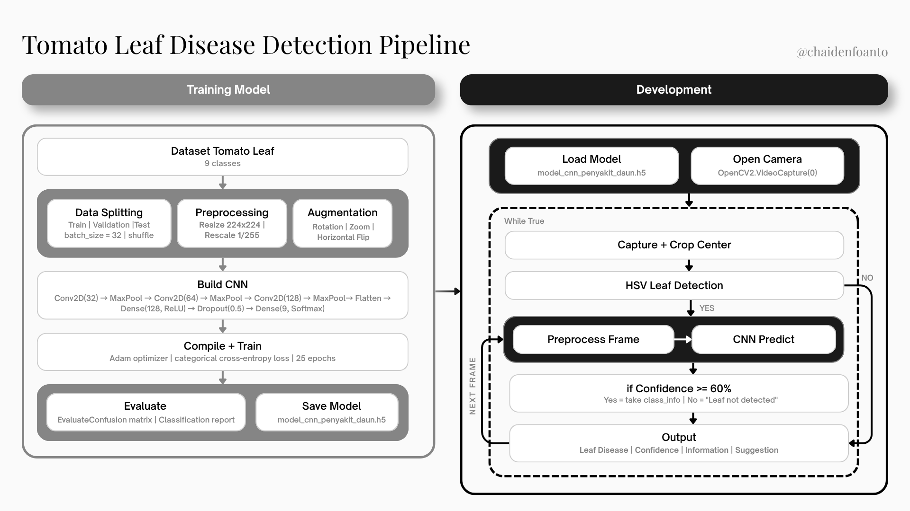

# Automatic Identification of Tomato Leaf Conditions Based on OpenCV and Convolutional Neural Networks

A real-time tomato leaf disease detection system using Convolutional Neural Network (CNN) and Computer Vision (OpenCV). The system captures live video from a webcam, detects whether a tomato leaf is present using HSV color segmentation, and classifies the type of disease with confidence scoring and treatment suggestions.

This project was inspired by a field trip to Sengka Village, South Sulawesi, where farmers had limited access to agricultural diagnostic tools and often could not identify diseases until significant crop damage had already occurred.

---

## System Pipeline



The pipeline consists of two stages. The first stage is offline model training: dataset preparation, preprocessing, CNN training, evaluation, and saving the model as a `.h5` file. The second stage is real-time deployment via `main.py`: the model is loaded once, the camera is opened, and then a `while True` loop runs per frame — capturing and cropping the center, checking for a leaf via HSV detection, preprocessing and predicting only if a leaf is found, applying a confidence threshold, and displaying the result.

---

## Machine Learning Approach

- Task: Multiclass image classification
- Model: Convolutional Neural Network (CNN)
- Framework: TensorFlow / Keras
- Training: Supervised learning on labeled tomato leaf images

CNN architecture:

```
Conv2D(32) → MaxPool → Conv2D(64) → MaxPool → Conv2D(128) → MaxPool
→ Flatten → Dense(128, ReLU) → Dropout(0.5) → Dense(9, Softmax)
```

Training configuration: Adam optimizer, categorical cross-entropy loss, 25 epochs, batch size 32.

---

## Features

- Real-time detection via webcam
- Leaf presence detection using HSV color segmentation (green ratio threshold >= 5%)
- CNN-based disease classification across 9 classes
- Confidence threshold filtering (>= 60%)
- Per-frame output: disease name, confidence score, description, treatment suggestion

---

## Model Performance

| Class | Precision | Recall | F1-Score |
|---|---|---|---|
| bacterial_spot | 0.87 | 0.92 | 0.90 |
| early_blight | 0.73 | 0.83 | 0.78 |
| healthy | 0.54 | 1.00 | 0.70 |
| late_blight | 0.96 | 0.71 | 0.82 |
| leaf_mold | 0.98 | 0.71 | 0.83 |
| septoria_leaf_spot | 0.77 | 0.83 | 0.80 |
| spotted_spider_mite | 0.93 | 0.60 | 0.73 |
| target_spot | 0.76 | 0.69 | 0.72 |
| yellow_leaf_curl_virus | 1.00 | 0.84 | 0.92 |

Overall: Accuracy 79%, Macro F1-score 0.80, Weighted F1-score 0.80.

`bacterial_spot` and `yellow_leaf_curl_virus` achieve the highest F1-scores. `healthy` and `spotted_spider_mite` show lower performance, likely due to visual similarity with other classes and sensitivity to real-time noise such as lighting variation and motion blur.

---

## Dataset

Dataset: [Tomato Disease Ready — Kaggle](https://www.kaggle.com/datasets/muhammadmasdar/tomato-disease-ready)

Additional access: [Google Drive](https://drive.google.com/drive/folders/1jBkckCgrZcV9nb1As1whHf5c6Cdl8Doj?usp=sharing)

The dataset is not included in this repository. Please download manually before running the training notebook.

---

## Requirements

```bash
pip install tensorflow numpy opencv-python
```

---

## How to Run

**1. Clone the repository**

```bash
git clone https://github.com/chaidenfoanto/Tomato_Leaf_Detection.git
cd Tomato_Leaf_Detection
```

**2. Download the dataset** (see Dataset section above) and train the model using the provided notebook. Save the output as:

```
model_cnn_penyakit_daun.h5
```

The model file is tracked via Git LFS.

**3. Run the application**

```bash
python main.py
```

The camera will open automatically. Point it at a tomato leaf. Press `Q` to exit.

---

## Limitations

- Sensitive to lighting conditions and image blur
- HSV leaf detection may fail under non-standard lighting
- Trained exclusively on tomato leaves; not generalizable to other crops

---

## Future Improvements

- Mobile deployment via Flutter + TensorFlow Lite
- Improved dataset balance across classes
- Image upload mode in addition to live webcam
- Extended support for additional crop types

---

## Research Publication

This project is documented in a peer-reviewed research paper:

Foanto, C. R., Widjaja, L., Lisal, A. J., & Suardi, C. (2025). Automatic Identification of Tomato Leaf Conditions Based on OpenCV and Convolutional Neural Networks. *INTRO: Jurnal Informatika dan Teknik Elektro*, 4(2), 112–118. https://doi.org/10.51747/intro.v4i2.425

---

## Acknowledgment

Dataset provided by the Kaggle community. Field trip to Sengka Village, South Sulawesi, provided the real-world context and motivation for this project.
